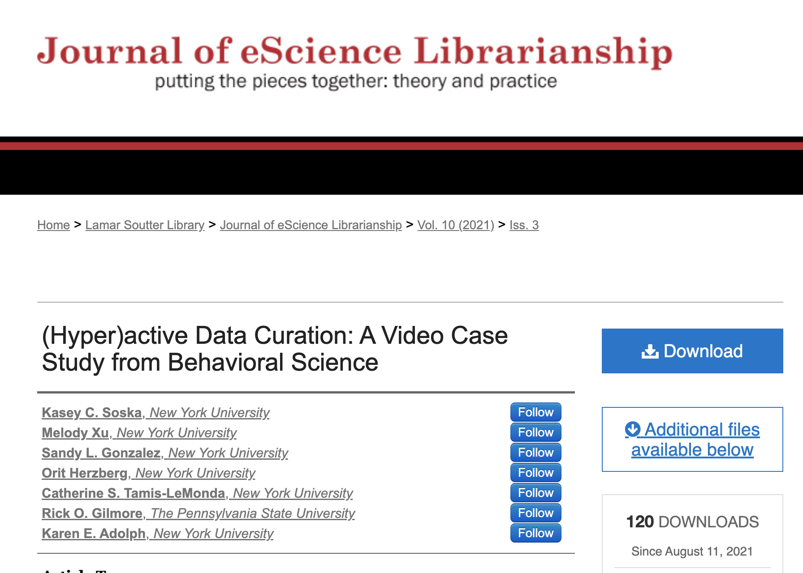
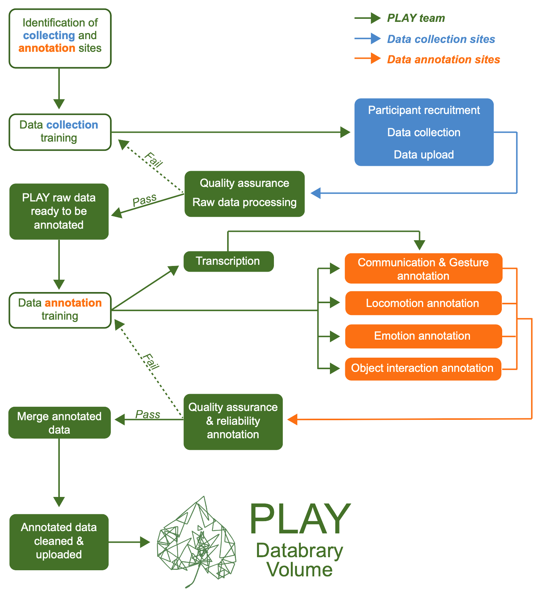
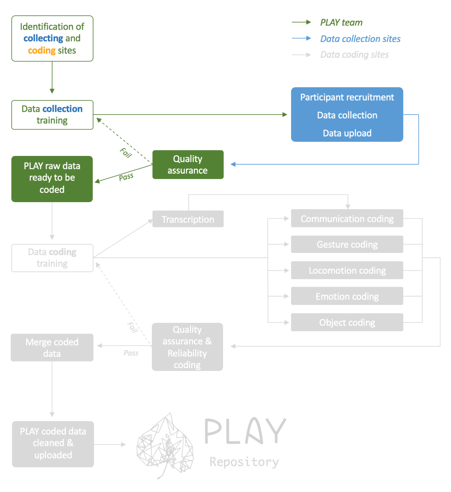
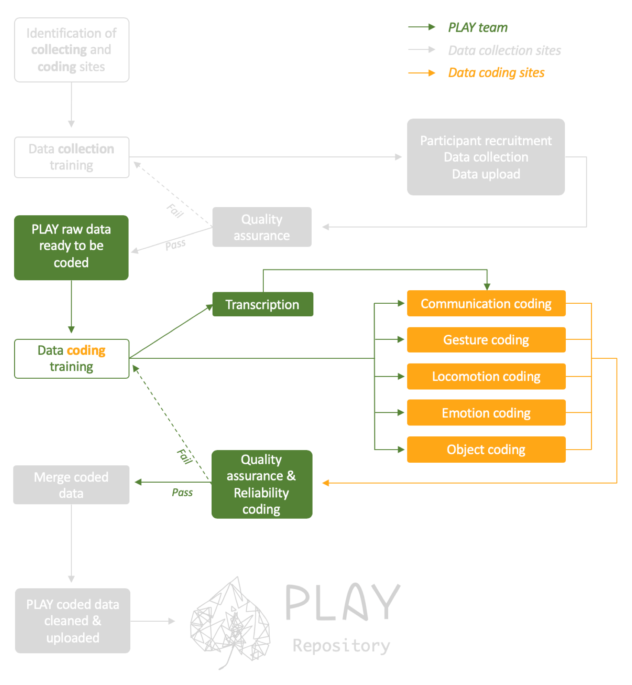
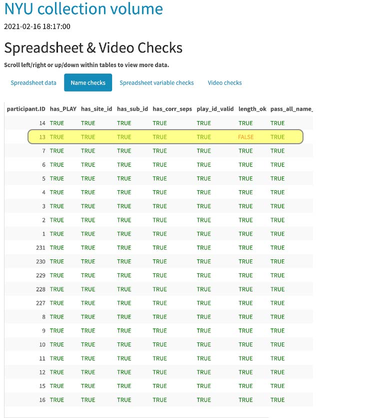
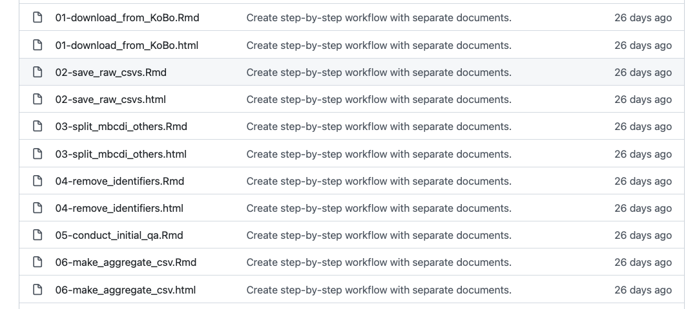
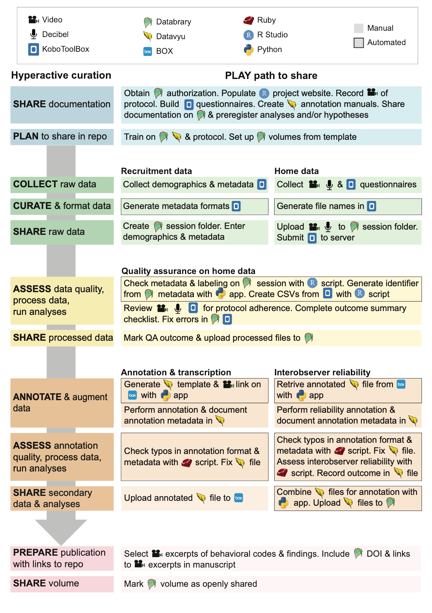
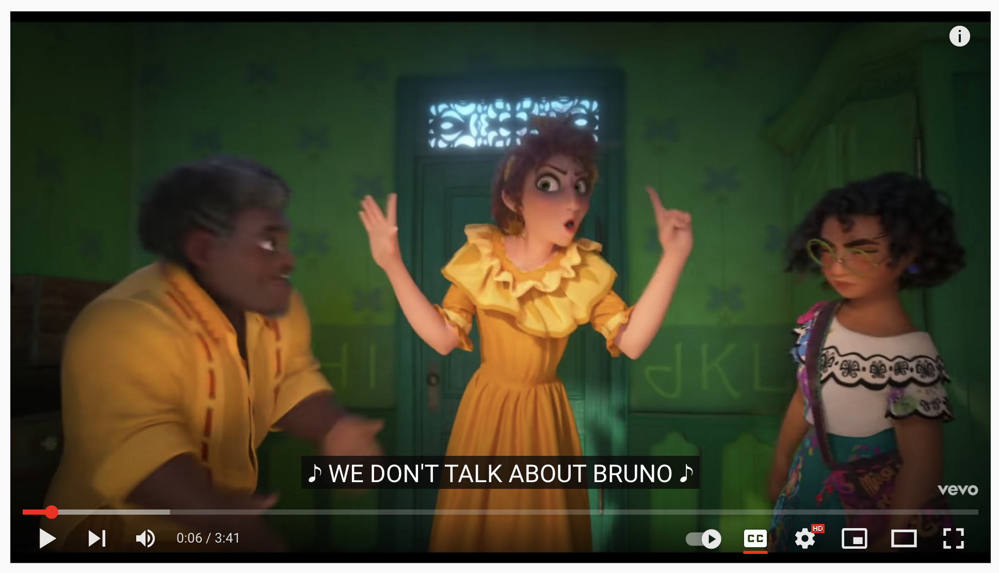

```{r setup, include=FALSE}
knitr::opts_chunk$set(echo = FALSE, warning = FALSE, 
                      message = FALSE,
                      fig.align = "center",
                      out.width = "800px")

library(tidyverse)
```

## Acknowledgements

- Support from NICHD, NIH/OD, NIMH, \& NIDA via R01HD094830-01; NSF via 2032713; the LEGO Foundation; \& the Alfred P. Sloan Foundation
- Karen Adolph, Cathie Tamis-LeMonda, Orit Hertzberg, Tiger Teng

## Overview

- A cautionary tale
- (Hyper)active Curation
- Lessons learned

# A cautionary tale

---

<!-- Data Sharing and Management Snafu in 3 Short Acts -->

<iframe width="560" height="315" src="https://www.youtube.com/embed/66oNv_DJuPc" frameborder="0" allow="accelerometer; autoplay; encrypted-media; gyroscope; picture-in-picture" allowfullscreen></iframe>

<small>[[@NYU_Health_Sciences_Library2013-gp]](https://www.youtube.com/watch?v=66oNv_DJuPc)</small>

# (Hyper)active curation

---

```{r, fig.cap="[[@Soska2021-mh]](http://dx.doi.org/10.7191/jeslib.2021.1208)", out.width="700px"}

```

## What is it?

- Embed data *curation* within data *collection* workflow
- Rigorous \& thorough quality assurance (QA) during collection
- Curate data with specific sharing target in mind

## Workflow {.smaller}

```{r, fig.cap="[[@Soska2021-mh]](http://dx.doi.org/10.7191/jeslib.2021.1208)"}

```

## Collection

```{r}

```

## Coding (video annotation)

```{r}

```

## Quality assurance (video)

- "Heavy" vs. "light" QA
- Semi-automated QA reports from Databrary
    - <https://github.com/PLAY-behaviorome/workflow/tree/master/session_qa_reports>
    - Not public

---

```{r, fig.cap="[[@Soska2021-mh]](http://dx.doi.org/10.7191/jeslib.2021.1208)"}

```

## Data export & cleaning (surveys)

- <https://github.com/PLAY-behaviorome/KoBoToolbox>
- Series of enumerated R Markdown documents
    - Reproducible
    - Documents gathering, cleaning steps

---

```{r, fig.cap="https://github.com/PLAY-behaviorome/KoBoToolbox"}

```

---

- Final CSV uploaded to Databrary
- `play_data <- databraryapi::read_csv_data_as_df(session_id = 51539, asset_id = 366382)`

## Summarized

```{r, fig.cap="[[@Soska2021-mh]](http://dx.doi.org/10.7191/jeslib.2021.1208)"}

```

## In-process

- Full protocol on <https://play-project.org>
- Considering migration of protocol to [`bookdown`](https://PLAY-behaviorome.github.io/protocol)
- Individual-level files
    - Including CHAT export of transcripts
- Clean, aggregate MB-CDI data
- From data dictionaries to open schemata

# Lessons learned

---

```{r}
knitr::include_graphics("https://www.rd.com/wp-content/uploads/2017/02/01-How-Bad-is-it-to-Share-a-Toothbrush-159311405-ABykov-760x506.jpg")
```

---

> "*...psychologists tend to treat other peoples’ theories like toothbrushes; no self-respecting individual wants to use anyone else’s.*"

<small>[[@Mischel2011-br]](https://www.psychologicalscience.org/observer/becoming-a-cumulative-science)</small>

---

> "*The toothbrush culture undermines the building of a genuinely cumulative science, encouraging more parallel play and solo game playing, rather than building on each other’s directly relevant best work.*"

<small>[[@Mischel2011-br]](https://www.psychologicalscience.org/observer/becoming-a-cumulative-science)</small>

---

> "...psychologists tend to treat other peoples’ ~~theories~~<span class="blue">data, data management practices, tasks, displays...</span>like toothbrushes..."

*Cheeky open and reproducible developmental science advocates who want to create a more cumulative science*

## We don't talk about (you know)...

```{r, fig.cap="[[@DisneyMusicVEVO2021-mv]](https://www.youtube.com/watch?v=bvWRMAU6V-c)"}

```

## Plan your work; work your plan

- You have to curate data for yourself, so...
- Clear to you == (often) clear to others
- Curate with specific target in mind

---

- Automate as much as possible
    - Script, use APIs
    - Exploit the web
    - Consistency is the ~~hobgoblin of little minds~~ key to successful automation!

---

- Test workflow at every step/look at data
- Expect to iterate
- Don't make the perfect the enemy of the good
- *Meaningful* data management plans increasingly [required by funders](https://psu-psychology.github.io/2021-10-01-odds-data-mgmt/)
- Make data a <span class="blue">first class product</span>

## Come PLAY with us!

- Share best practices
- Talk about "you know"
- Let's solve as-yet-unsolved problems...together
- No reinventing wheels

```{r, child="play-splash.Rmd"}
```

```{r, child="splash.Rmd"}
```

```{r, child="resources.Rmd"}
```