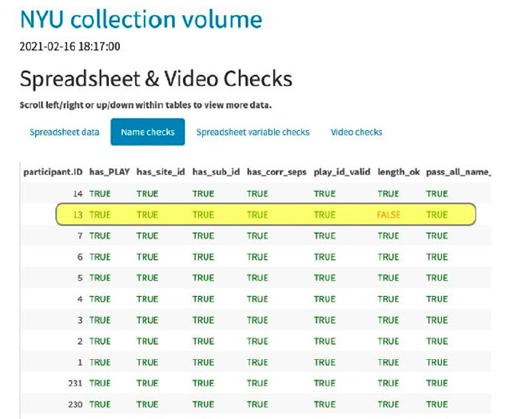

```{r setup, include=FALSE}
knitr::opts_chunk$set(echo = FALSE, warning = FALSE, 
                      message = FALSE,
                      fig.align = "center",
                      out.width = "800px")

library(tidyverse)
```

## Acknowledgements

- Support from NICHD, NIH OD, NIMH, NIDA, OBSSR, NSF
- Karen Adolph, Cathie Tamis-LeMonda, Orit Hertzberg, Tiger Teng

## Overview

- A cautionary tale
- (Hyper)active Curation
- Lessons learned

# A cautionary tale

---

<!-- Data Sharing and Management Snafu in 3 Short Acts -->

<iframe width="560" height="315" src="https://www.youtube.com/embed/66oNv_DJuPc" frameborder="0" allow="accelerometer; autoplay; encrypted-media; gyroscope; picture-in-picture" allowfullscreen></iframe>

<small>[[@NYU_Health_Sciences_Library2013-gp]](https://www.youtube.com/watch?v=66oNv_DJuPc)</small>

# (Hyper)active curation

---

```{r, fig.cap="[[@Soska2021-mh]](http://dx.doi.org/10.7191/jeslib.2021.1208)", out.width="700px"}
knitr::include_graphics("img/hyperactive.png")
```

## What is it?

- Embed data curation within data collection workflow
- Conduct rigorous quality assurance (QA) during collection
- Curate data with specific sharing target in mind

## Workflow {.smaller}

```{r, fig.cap="[[@Soska2021-mh]](http://dx.doi.org/10.7191/jeslib.2021.1208)"}
knitr::include_graphics("img/soska-etal-figure3.png")
```

## Collection

```{r}
knitr::include_graphics("img/overview-collecting.png")
```

## Coding (video annotation)

```{r}
knitr::include_graphics("img/overview-coding.png")
```

## Quality assurance (video)

- "Heavy" vs. "light" QA
- Semi-automated QA reports from Databrary
    - <https://github.com/PLAY-behaviorome/workflow/tree/master/session_qa_reports>
    - Not public

---

```{r, fig.cap="[[@Soska2021-mh]](http://dx.doi.org/10.7191/jeslib.2021.1208)"}

```

## Data export & cleaning (surveys)

- <https://github.com/PLAY-behaviorome/KoBoToolbox>
- Series of enumerated R Markdown documents

---

```{r, fig.cap="https://github.com/PLAY-behaviorome/KoBoToolbox"}
knitr::include_graphics("img/kobo-workflow.png")
```

---

- Final CSV uploaded to Databrary
- `play_data <- databraryapi::read_csv_data_as_df(session_id = 51539, asset_id = 366382)`

## Summarized

```{r, fig.cap="[[@Soska2021-mh]](http://dx.doi.org/10.7191/jeslib.2021.1208)"}
knitr::include_graphics("img/soska-etal-figure1.png")
```

## In-process

- Moving protocol to `bookdown`
- <https://PLAY-behaviorome.github.io/protocol>

# Lessons learned

## Plan your work; work your plan

- You have to curate data for yourself
- Clear to you == (often) clear to others
- Automate as much as possible
    - Script, use APIs
- Expect to iterate
- Don't make the perfect the enemy of the good

---

```{r}
knitr::include_graphics("img/PLAY-logo.png")
```

```{r, child="splash.Rmd"}
```

```{r, child="resources.Rmd"}
```