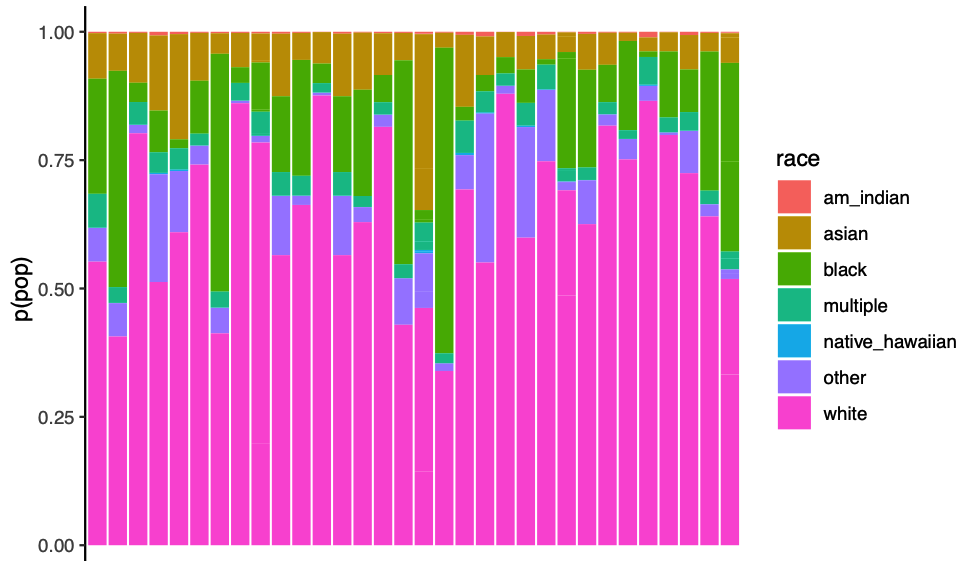

```{r setup, include=FALSE}
knitr::opts_chunk$set(echo = FALSE, warning = FALSE, 
                      message = FALSE,
                      fig.align = "center",
                      out.width = "800px")

library(tidyverse)
```

## Acknowledgements

- Support from NICHD, NIH OD, NIMH, NIDA, OBSSR, NSF
- Karen Adolph, Cathie Tamis-LeMonda, Orit Hertzberg, Tiger Teng

## Overview

- What is PLAY
- Why PLAY
- Challenges to face
- Challenges met
- Challenges yet-to-be-met
- A preview

# What is PLAY

---

```{r}
knitr::include_graphics("img/PLAY-logo.png")
```

---

<video width="100%" controls>
  <source src="https://www.anhourinthelife.org/img/PLAY-parents-noaudio.mp4" type="video/mp4">
</video>

---

- 1,000 mother-infant dyads (12-, 18-, 24-mos)
- 1 hr natural behavior (video)
- 5 min structured play (video)
- House tour (video)
- Parent-report questionnaires
- Ambient sound levels

---

- Foundational video coding passes
    - Speech \& language
    - Emotional expression
    - Object interaction
    - Locomotion \& physical activity
    
---

- Common, shared data
- Rigorous QA control
- Investigator-specific questions...
- Dataset as deliverable
- Catalyze/expand capacity to exploit video

# Why PLAY

## Natural behavior

- Environments outside the lab most representative of children's experiences
- Rich, varied, interesting, \& important [[@Adolph2020-rj]](http://dx.doi.org/10.1111/infa.12336)
- Can be captured with video [[@Adolph_KE_Gilmore_RO_Kennedy_JL2017-va]](https://www.apa.org/science/about/psa/2017/10/video-data)
- Can be analyzed systematically by human observers
- Tackling the 'generalizability crisis' [[@Yarkoni2020-se]](http://dx.doi.org/10.1017/S0140525X20001685)

## Big data developmental science

- [[@gilmore_big_2016]](https://doi.org/10.1002/wcs.1379)
- No comparable data corpus exists
- Existing datasets smaller in scale

## Open science

- Full transparency
    - Planning workshop: https://nyu.databrary.org/volume/254
    - Web site (https://play-project.org), https://github.com/PLAY-behaviorome/PLAY-project.org
    - Data management \& curation [[@Soska2021-mh]](http://dx.doi.org/10.7191/jeslib.2021.1208)
- Planning for future reuse

---

```{r}
knitr::include_graphics("img/SRCD-policy.png")
```

<https://www.srcd.org/policy-scientific-integrity-transparency-and-openness>

---

>"*The advancement of detailed and diverse knowledge about the development of the world’s children is essential for improving the health and well-being of humanity. The Society for Research in Child Development (SRCD) regards scientific integrity, transparency, and openness as essential for the conduct of research and its application to practice and policy. These values apply to research conduct, to the teaching of scientific methods, and to the translation of science into practice and policy.*"

<div class="center">
<https://www.srcd.org/policy-scientific-integrity-transparency-and-openness>
<div>
---

[[@Gilmore2020-sl]](https://doi.org/10.1111/cdep.12360) | [[@Gennetian2020-ji]](https://doi.org/10.1111/cdep.12356)

# Challenges to face

## Sampling

- Age range(s)
- What language backgrounds...
- Who to include?
- Where to sample...
- What to vary, what to keep constant...
- Is ['an hour in the life'](https://www.anhourinthelife.org/) representative?
- What survey questions \& how to collect

# Challenges met

---

- 12-mo-olds, 18-mo-olds, & 24-mo-olds
- Only English and Spanish-speaking households
- Mom and child
- 31 sites

---

```{r}
knitr::include_graphics("img/PLAY-sites.png")
```

---

- Informed by Census demographics
  - https://github.com/PLAY-behaviorome/site-demographics
  - [`tidycensus`](https://walker-data.com/tidycensus/) R package

---

```{r}

```

## Survey questions

- Health
- Patient Health Questionnaire (PHQ-4)
- Locomotor milestones
- MacArthur-Bates CDI

---

- ECBQ (Rothbart)
- Media use
- Pets
- Household structure
- Typical day?

---

```{r}
knitr::include_graphics("img/kobotoolbox.png")
```

# Challenges yet-to-be-met

---

- Findable, useable beyond launch group
- Limitations of Databrary 1.0
    - Virtual volumes?
- Versioning data, protocol, coding scheme
- Add-on, follow-up studies
    - New data
    - Augmented, new annotations
- COVID-19
    
# A preview

## Databrary

<https://nyu.databrary.org/volume/444>

## Databrary access levels

```{r}
knitr::include_graphics("img/databrary-release-levels.png")
```

## 1-hour natural play

<https://nyu.databrary.org/slot/18825/78777000,82445800/asset/85849/download?inline=true>

## House walk-through

<https://nyu.databrary.org/slot/18825/69908000,70431136/asset/85853/download?inline=true>

## Structured play

<https://nyu.databrary.org/slot/18825/85767000,86228590/asset/85865/download?inline=true>

## Parent-report questionnaires

<https://nyu.databrary.org/slot/18825/82179000,85191864/asset/85867/download?inline=true>

## Load PLAY survey data

```
databraryapi::login_db("myemail@university.edu")

play_data <- databraryapi::read_csv_data_as_df(session_id = 51539, asset_id = 366382)
```

```{r, include=FALSE}
databraryapi::login_db(params$db_login)
play_data <- databraryapi::read_csv_data_as_df(session_id = 51539, asset_id = 366382)
```

## Demographics

````
xtabs(formula = ~ child_sex + age_group, data = play_data) %>%
  knitr::kable(., format = 'html') %>%
  kableExtra::kable_classic(.)
````

```{r}
xtabs(formula = ~ child_sex + age_group, data = play_data) %>%
  knitr::kable(., format = 'html') %>%
  kableExtra::kable_classic(.)
```

---

````
xtabs(formula = ~ child_race + child_ethnicity, data = play_data) %>%
  knitr::kable(., format = 'html') %>%
  kableExtra::kable_classic(.)
````

```{r}
xtabs(formula = ~ child_race + child_ethnicity, data = play_data) %>%
  knitr::kable(., format = 'html') %>%
  kableExtra::kable_classic(.)
```

## Locomotor milestones

```{r, echo=FALSE}
loco_feeding_data <- play_data %>%
  dplyr::select(
    .,
    age_group,
    child_sex,
    locomotor_milestones.who_walk.who_walk_onset_mo,
    locomotor_milestones.k_walk.k_walk_onset_mo,
    locomotor_milestones.crawl_onset.crawl_onset_mo,
    health.feeding_nutrition.solidfood_age,
    health.feeding_nutrition.breastfeed,
  ) %>%
  dplyr::rename(
    .,
    walk_mos_who = locomotor_milestones.who_walk.who_walk_onset_mo,
    walk_mos = locomotor_milestones.k_walk.k_walk_onset_mo,
    crawl_mos = locomotor_milestones.crawl_onset.crawl_onset_mo,
    solid_food_mos = health.feeding_nutrition.solidfood_age,
    breastfeed = health.feeding_nutrition.breastfeed
  )

crawl_walk_p <- loco_feeding_data %>%
  ggplot(.) +
  aes(walk_mos, crawl_mos, color = child_sex) +
  geom_smooth(method = "lm", aes(group = 1)) +
  geom_point() +
  theme(legend.position = "bottom") 

ggExtra::ggMarginal(
  crawl_walk_p,
  loco_feeding_data,
  walk_mos,
  crawl_mos,
  type = "density",
  margins = "both",
  groupColour = TRUE,
  groupFill = TRUE
)
```

## Feeding

```{r, echo=FALSE}
crawl_solid_p <- loco_feeding_data %>%
  ggplot(.) +
  aes(
    x = crawl_mos,
    y = solid_food_mos,
    color = child_sex
  ) +
  geom_point() +
  geom_smooth(method = "lm", aes(group = 1)) +
  theme(legend.position = "bottom")

ggExtra::ggMarginal(
  crawl_solid_p,
  loco_feeding_data,
  crawl_mos,
  solid_food_mos,
  type = "density",
  margins = "both",
  groupColour = TRUE,
  groupFill = TRUE
)
```

## Typical behavior?

````
xtabs(formula = ~ typical_behavior + age_group, data = typical_data) %>%
  knitr::kable(., format = 'html') %>%
  kableExtra::kable_classic(.)
````

```{r, echo=FALSE}
typical_data <- play_data %>%
  dplyr::select(., child_sex,
                age_group,
                typical_day.typical_behavior,
                typical_day.typical_activities,
                typical_day.typical_nightmorning,
                typical_day.typical_otherthanme) %>%
  dplyr::rename(., 
                typical_behavior = typical_day.typical_behavior,
                typical_activities = typical_day.typical_activities,
                typical_nightmorning = typical_day.typical_nightmorning,
                typical_otherthanme = typical_day.typical_otherthanme)

xtabs(formula = ~ typical_behavior + age_group, data = typical_data) %>%
  knitr::kable(., format = 'html') %>%
  kableExtra::kable_classic(.)
```

## Typical night/morning?

````
xtabs(formula = ~ typical_nightmorning + age_group, data = typical_data) %>%
  knitr::kable(., format = 'html') %>%
  kableExtra::kable_classic(.)
````

```{r, echo=FALSE, message=FALSE}
xtabs(formula = ~ typical_nightmorning + age_group, data = typical_data) %>%
  knitr::kable(., format = 'html') %>%
  kableExtra::kable_classic(.)
```

```{r}
databraryapi::logout_db()
```

---

```{r}
knitr::include_graphics("img/PLAY-logo.png")
```

```{r, child="splash.Rmd"}
```

```{r, child="resources.Rmd"}
```