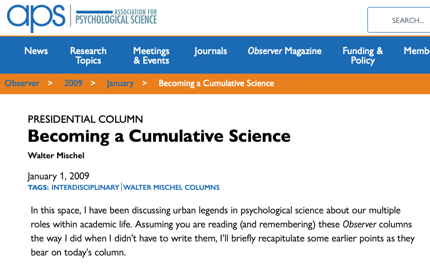

```{r setup, include=FALSE}
knitr::opts_chunk$set(echo = FALSE, warning = FALSE, 
                      message = FALSE,
                      fig.align = "center",
                      out.width = "800px")

library(tidyverse)
```

## Acknowledgements

- Support from NICHD, NIH/OD, NIMH, \& NIDA via R01HD094830-01; NSF via 2032713; the LEGO Foundation; \& the Alfred P. Sloan Foundation
- Karen Adolph, Cathie Tamis-LeMonda, Orit Hertzberg, Tiger Teng

## Overview

- What is PLAY
- Why PLAY
- Challenges..met and meeting
- A sneak peak
- Let play be our work

# What is PLAY

---

```{r, fig.cap="[72 investigators across 50 institutions](https://www.play-project.org/people.html)"}
knitr::include_graphics("img/PLAY-logo.png")
```

---

<div class="centered">
<video width="80%" controls>
  <source src="https://www.anhourinthelife.org/img/PLAY-parents-noaudio.mp4" type="video/mp4">
</video>

<https://anhourinthelife.org>
</div>

---

- ~1,000 mother-infant dyads (12-, 18-, 24-mos)
- 1 hr natural behavior (video)
- 5 min structured play (video)
- House tour (video)
- Parent-report questionnaires (video \& electronic form)
- Ambient sound levels

---

- Rigorous quality assurance (QA) control
- Utterance-level [transcription](https://www.play-project.org/coding.html#Transcription) (child \& mother)
- Foundational video coding passes covering multiple psychological domains
    - Language and communication
    - Locomotion and physical activity
    - Object interaction
    - Emotional expression
- Using [Datavyu](https://datavyu.org)

---

- Common, openly shared dataset on [Databrary](https://databrary.org)
- Dataset as deliverable
- Investigator-specific questions...
- Catalyze/expand capacity to exploit video
- Pioneer \& polish tools for big data open developmental science

# Why PLAY

## Whys

- Conceptual
- Analytical
- Methodological

## Natural behavior

- Rich, varied, interesting, \& important [[@Adolph2020-rj]](http://dx.doi.org/10.1111/infa.12336)
- Can be captured with video
[[@Adolph_KE_Gilmore_RO_Kennedy_JL2017-va]](https://www.apa.org/science/about/psa/2017/10/video-data)
- Can be analyzed systematically by human observers
- Environments *outside the lab* most representative of children's experiences
- Tackling the 'generalizability crisis' [[@Yarkoni2020-se]](http://dx.doi.org/10.1017/S0140525X20001685), head-on [[@West2022-um]](http://dx.doi.org/10.1017/S0140525X21000522).

## Behavior is multi-dimensional, yet...

```{r, out.width="850px"}
knitr::include_graphics("http://cdn2.hubspot.net/hub/134568/file-1208368053-jpg/6-blind-men-hans.jpg")
```

<!-- We don't have to be like the blind men and the elephant -->

---

```{r, out.width="450px"}
knitr::include_graphics("http://static.neatorama.com/images/2012-09/girl-hugging-elephant.jpg")
```

---

```{r, fig.cap="[[@Szucs2017-fc]](http://doi.org/10.1371/journal.pbio.2000797)"}
knitr::include_graphics("http://journals.plos.org/plosbiology/article/file?id=10.1371/journal.pbio.2000797.g003&type=large")
```

> "*Assuming a realistic range of prior probabilities for null hypotheses, false report probability is likely to exceed 50% for the whole literature.*"

---

```{r, out.width="750px", fig.cap="[[@Marek2022-vu]](http://dx.doi.org/10.1038/s41586-022-04492-9)"}
knitr::include_graphics("img/marek-et-al-2022.png")
```

## Open developmental science

- Presents opportunities [[@Gennetian2020-ji]](https://doi.org/10.1111/cdep.12356) 
- Poses surmountable challenges [[@Gilmore2020-sl]](https://doi.org/10.1111/cdep.12360)
- "...will be more rigorous, robust, and impactful" [[@Gilmore2021-zr]](https://doi.org/10.1002/icd.2254)

---

```{r, fig.cap="https://www.srcd.org/policy-scientific-integrity-transparency-and-openness"}
knitr::include_graphics("img/SRCD-policy.png")
```

---

> "*The advancement of detailed and diverse knowledge about the development of the world’s children is essential for improving the health and well-being of humanity. The Society for Research in Child Development (SRCD) regards scientific integrity, transparency, and openness as essential for the conduct of research and its application to practice and policy. These values apply to research conduct, to the teaching of scientific methods, and to the translation of science into practice and policy.*"

<div class="center">
<https://www.srcd.org/policy-scientific-integrity-transparency-and-openness>
<div>

## PLAY: Science in the open
    
- Planning [workshop](https://nyu.databrary.org/volume/254)
- Web site (<https://play-project.org>) \& [protocol videos](https://databrary.org/volume/876)
- Data management \& curation [[@Soska2021-mh]](http://dx.doi.org/10.7191/jeslib.2021.1208)
- [GitHub repo](https://github.com/PLAY-behaviorome/PLAY-project.org)
- Planning for future reuse

## Growing [Databrary](https://databrary.org)

- Restricted access data library 
- Specialized for storing \& sharing video/audio + related data
- Protects identifiable or sensitive data
- Permits onen (but not necessarily public) 
- Emphasize participant permission-to-share
    
---

- Video as data [[@Adolph_KE_Gilmore_RO_Kennedy_JL2017-va]](https://www.apa.org/science/about/psa/2017/10/video-data), [demonstration](https://databrary.org/support/irb/examples.html), & documentation [[@GilmoreAdolph2017]](https://doi.org/10.1038/s41562-017-0128) 
- Developed by and especially for developmental scientists

---

```{r, out.width="700px", fig.cap="https://gilmore-lab.github.io/databrary-analytics/weekly/databrary_weekly_report.html"}
knitr::include_graphics("img/databary-weekly-2022-04-18.png")
```

## Video, audio, + [other types](https://nyu.databrary.org/asset/formats) {.smaller}

```{r, out.width="700px", fig.cap="https://gilmore-lab.github.io/databrary-analytics/volumes-with-videos-annotations/assets-stats.html"}
knitr::include_graphics("img/databrary-shared-files.png")
```

# Challenges...met and meeting

## Sampling

- Who to include?
- Age range(s)?
- What language backgrounds?
- Where to sample?
- What to vary, what to keep constant?

---

- Is ['an hour in the life'](https://www.anhourinthelife.org/) representative?
- What parent-report survey questions \& how to collect?
- What behaviors to code from video?

---

- 12-mo-olds, 18-mo-olds, & 24-mo-olds
- Only English and Spanish-speaking households
- Child and mother
- 31 sites

---

```{r}
knitr::include_graphics("img/PLAY-sites.png")
```

---

- Informed by Census demographics
  - https://github.com/PLAY-behaviorome/site-demographics
  - [`tidycensus`](https://walker-data.com/tidycensus/) R package
  - [`collection-site-demographics.Rmd`](collection-site-demographics.Rmd)

---

```{r, fig.cap="Races reported in PLAY counties", out.height="500px"}
knitr::include_graphics("img/race-fig-1.png")
```

---

```{r, fig.cap="Ethnicity reported in PLAY counties", out.height="500px"}
knitr::include_graphics("img/ethnicity-fig-1.png")
```

---

```{r, fig.cap="Languages spoken in PLAY counties", out.height="500px"}
knitr::include_graphics("img/langs-spoken-1.png")
```

---

```{r, fig.cap="Educational attainment in PLAY counties", out.height="500px"}
knitr::include_graphics("img/ed-attain-1.png")
```

---

```{r, fig.cap="Household income in PLAY counties", out.height="500px"}
knitr::include_graphics("img/income-1.png")
```

## Survey questions

- Health
    - Child health
    - Mother prenatal health \& behavior
    - Mother mental health (PHQ-4)
- Early Childhood Behavior Questionnaire (Rothbart)
   
---

- Locomotor milestones
- MacArthur-Bates Communicative Development Inventory (MB-CDI)
    - New dual-language learning (DLL) inventory [Tamis-Lemonda, et al.](https://databrary.org/volume/1168)

---

- Media use
- Pets
- Household structure
- Division of labor
- Typical day

---

```{r, fig.cap="https://kobotoolbox.org"}
knitr::include_graphics("img/kobotoolbox.png")
```

## Behaviors to code

- Foundational video coding passes
    - [Communication](https://www.play-project.org/coding.html#Communication_coding) \& [gesture](https://www.play-project.org/coding.html#Gesture_coding)
    - [Emotion](https://www.play-project.org/coding.html#Emotion_coding)
    - [Object interaction](https://www.play-project.org/coding.html#Object_Interaction_coding)
    - [Locomotion](https://www.play-project.org/coding.html#Locomotion_coding)
- Multivariate, interlocking timelines of infant and mother behavior: <smaller> <https://nyu.databrary.org/slot/27087/0,372193/asset/119877/download?inline=true></smaller>

## Other challenges

- IRB
    - Distributed collection \& coding
    - Common sharing permission language based on [Databrary template](https://databrary.org/support/irb.html)
    - Common data use agreement: [Databrary Access Agreement](https://databrary.org/about/agreement.html)
    
---

- Findable, usable beyond launch group
- Limitations of Databrary 1.0
    - Data in-process vs. data shared
    - Original data in original volume, but also in aggregate PLAY volume
- Versioning data, protocol, coding schemes

---

- Add-on, follow-up studies
    - New data
    - Augmented, new video annotations
- COVID-19
    
# A sneak peak

## Release levels

```{r, fig.cap="https://databrary.org/support/irb/release-levels.html"}
knitr::include_graphics("img/databrary-release-levels.png")
```

## Video data

- 1-hour natural play: <https://nyu.databrary.org/slot/18825/78777000,82445800/asset/85849/download?inline=true>
- Structured play: <https://nyu.databrary.org/slot/18825/85767000,86228590/asset/85865/download?inline=true>
- Parent-report questionnaires: <https://nyu.databrary.org/slot/18825/82179000,85191864/asset/85867/download?inline=true>

--- 

- House walk-through: <https://nyu.databrary.org/slot/18825/69908000,70431136/asset/85853/download?inline=true>

---

<div class="centered">
<video width="80%" controls>
  <source src="vid/LEGO_housemap_big10x.mp4" type="video/mp4">
Your browser does not support the video tag.
</video>
</div>

---

```{r, fig.cap="[[@Herzberg2022-js]](http://dx.doi.org/10.1111/cdev.13669)", out.width="700px"}
knitr::include_graphics("img/LEGO-timelines-hertzberg-etal.png")
```

---

```{r, fig.cap="[[@Herzberg2022-js]](http://dx.doi.org/10.1111/cdev.13669)", out.width="700px"}
knitr::include_graphics("img/LEGO-timelines-hertzberg-etal-3.png")
```

## Survey data

- Exploit `databraryapi` R package that interacts with Databrary API
    - [[@Gilmore_undated-mj]](https://github.com/PLAY-behaviorome/databraryapi)
- Reproducible data cleaning, visualization, and analysis scripts from the get-go

---

```
databraryapi::login_db("myemail@university.edu")

play_data <- databraryapi::read_csv_data_as_df(session_id = 51539, asset_id = 366382)
```

```{r, include=FALSE}
databraryapi::login_db(params$db_login)
play_data <- databraryapi::read_csv_data_as_df(session_id = 51539, asset_id = 366382)
```

## Demographics

````
xtabs(formula = ~ child_sex + age_group, data = play_data) %>%
  knitr::kable(., format = 'html') %>%
  kableExtra::kable_classic(.)
````

```{r}
xtabs(formula = ~ child_sex + age_group, data = play_data) %>%
  knitr::kable(., format = 'html') %>%
  kableExtra::kable_classic(.)
```

---

````
xtabs(formula = ~ child_race + child_ethnicity, data = play_data) %>%
  knitr::kable(., format = 'html') %>%
  kableExtra::kable_classic(.)
````

```{r}
xtabs(formula = ~ child_race + child_ethnicity, data = play_data) %>%
  knitr::kable(., format = 'html') %>%
  kableExtra::kable_classic(.)
```

## Virtues of standardization within a repository

- Databrary has demographic data from $n=9,342$ [participant sessions](https://gilmore-lab.github.io/databrary-analytics/participant-demographics/participant-demog-report.html#Overall)
- [Race](https://gilmore-lab.github.io/databrary-analytics/participant-demographics/participant-demog-report.html#Race) (NIH categories), [Ethnicity](https://gilmore-lab.github.io/databrary-analytics/participant-demographics/participant-demog-report.html#Ethnicity) (NIH categories), [Gender](https://gilmore-lab.github.io/databrary-analytics/participant-demographics/participant-demog-report.html#Gender)
- Foundation for future searching and filtering by participant characteristics

## Locomotor milestones

```{r, echo=FALSE}
loco_feeding_data <- play_data %>%
  dplyr::select(
    .,
    age_group,
    child_sex,
    locomotor_milestones.who_walk.who_walk_onset_mo,
    locomotor_milestones.k_walk.k_walk_onset_mo,
    locomotor_milestones.crawl_onset.crawl_onset_mo,
    health.feeding_nutrition.solidfood_age,
    health.feeding_nutrition.breastfeed,
  ) %>%
  dplyr::rename(
    .,
    walk_mos_who = locomotor_milestones.who_walk.who_walk_onset_mo,
    walk_mos = locomotor_milestones.k_walk.k_walk_onset_mo,
    crawl_mos = locomotor_milestones.crawl_onset.crawl_onset_mo,
    solid_food_mos = health.feeding_nutrition.solidfood_age,
    breastfeed = health.feeding_nutrition.breastfeed
  )

crawl_walk_p <- loco_feeding_data %>%
  ggplot(.) +
  aes(walk_mos, crawl_mos, color = child_sex) +
  geom_smooth(method = "lm", aes(group = 1)) +
  geom_point() +
  theme(legend.position = "bottom") 

ggExtra::ggMarginal(
  crawl_walk_p,
  loco_feeding_data,
  walk_mos,
  crawl_mos,
  type = "density",
  margins = "both",
  groupColour = TRUE,
  groupFill = TRUE
)
```

## Feeding

```{r, echo=FALSE}
crawl_solid_p <- loco_feeding_data %>%
  ggplot(.) +
  aes(
    x = solid_food_mos,
    color = child_sex,
    fill = child_sex
  ) +
  geom_histogram() +
  theme(legend.position = "bottom")

crawl_solid_p
```

---

```{r}
phq4_levels <- c('notatall', 'severaldays', 'morethanhalf', 'nearly')
phq4_labels <- c('not_at_all', 'several_days', 'more_than_half', 'nearly_every')

phq4 <- play_data %>%
  dplyr::select(
    .,
    age_group,
    child_sex,
    health.phq4.phq4_nervous,
    health.phq4.phq4_worrying,
    health.phq4.phq4_littleinterest,
    health.phq4.phq4_down
  ) %>%
  dplyr::rename(
    .,
    nervous = health.phq4.phq4_nervous,
    worrying = health.phq4.phq4_worrying,
    little_interest = health.phq4.phq4_littleinterest,
    down = health.phq4.phq4_down
  ) %>%
  dplyr::mutate(
    .,
    nervous = factor(
      nervous,
      levels = phq4_levels,
      labels = phq4_labels,
      ordered = TRUE
    ),
    worrying = factor(
      worrying,
      levels = phq4_levels,
      labels = phq4_labels,
      ordered = TRUE
    ),
    little_interest = factor(
      little_interest,
      levels = phq4_levels,
      labels = phq4_labels,
      ordered = TRUE
    ),
    down = factor(
      down,
      levels = phq4_levels,
      labels = phq4_labels,
      ordered = TRUE
    )
  )
```

## Patient Health Questionnaire (PHQ-4)

- Depression screen

> "*Over the last two weeks, how often have you been bothered by the following problems?*"

---

> "*Feeling nervous, anxious, or on edge*"

```{r}
l_nervous <- likert::likert(as.data.frame(phq4$nervous), )
plot(l_nervous, )
```

```{r}
databraryapi::logout_db()
```

# Making play our work

---

- Big data developmental science of *natural behavior* is possible \& *necessary*
- Cognition and emotion *in context*
- Ambition and vision drive innovation
- Future-orientation (what will future researchers want to know) challenging, but invigorating
- What do we want our science to be about?

---

```{r, fig.cap="[[@Mischel2011-br]](https://www.psychologicalscience.org/observer/becoming-a-cumulative-science)"}

```

## Come PLAY with us!

- Collaborate with a launch group member
- Write grants to use the data
- Help test, polish the `databraryapi` R package and complete the Python package
- Help shape, test Databrary 2.0
- Make developmental science a leader in big data research on children's behavior, thinking, and feeling 

```{r, child="play-splash.Rmd"}
```

```{r, child="splash.Rmd"}
```

```{r, child="resources.Rmd"}
```