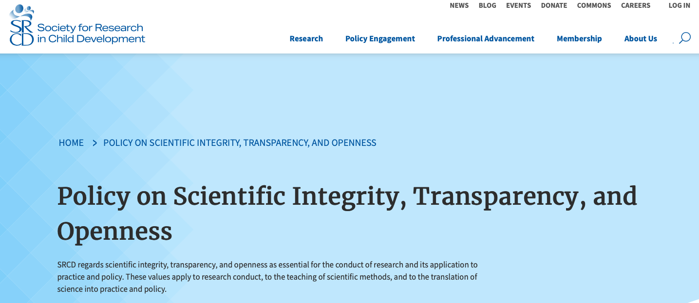
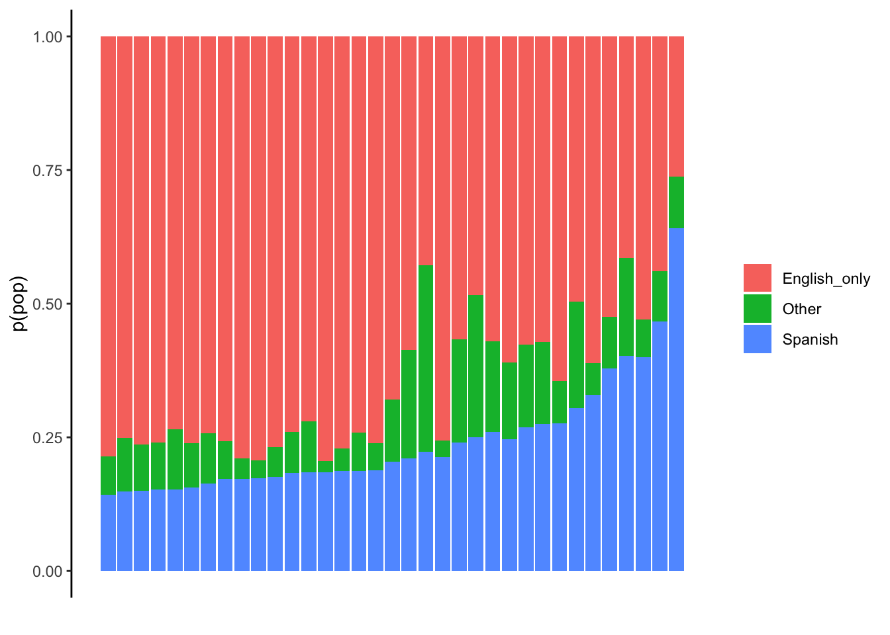
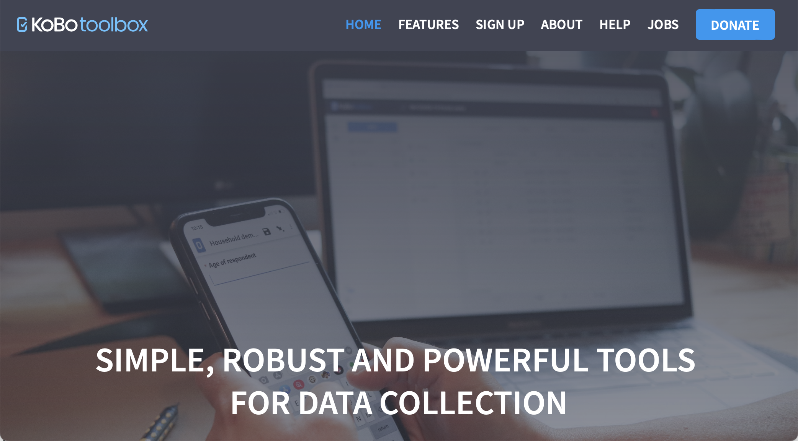
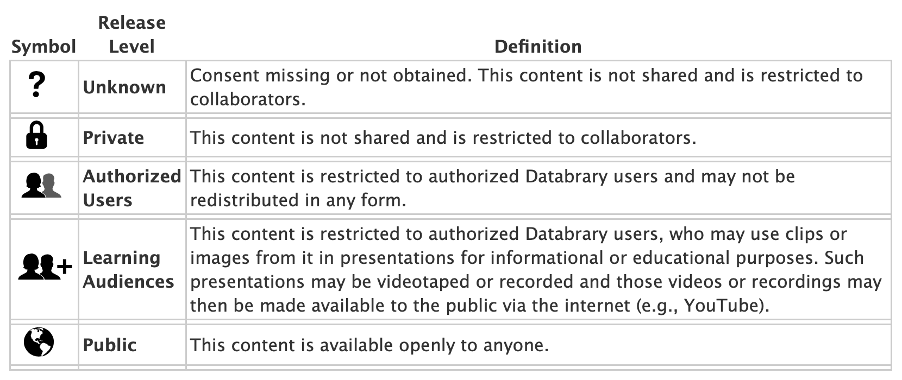

```{r setup, include=FALSE}
knitr::opts_chunk$set(echo = FALSE, warning = FALSE, 
                      message = FALSE,
                      fig.align = "center",
                      out.width = "800px")

library(tidyverse)
```

## Acknowledgements

- Support from NICHD, NIH OD, NIMH, NIDA, OBSSR, NSF
- Karen Adolph, Cathie Tamis-LeMonda, Orit Hertzberg, Tiger Teng

## Overview

- What is PLAY
- Why PLAY
- Challenges..met and meeting
- A preview
- Let play be our work

# What is PLAY

---

```{r}
knitr::include_graphics("img/PLAY-logo.png")
```

---

<video width="80%" controls>
  <source src="https://www.anhourinthelife.org/img/PLAY-parents-noaudio.mp4" type="video/mp4">
</video>

<https://anhourinthelife.org>

---

- ~1,000 mother-infant dyads (12-, 18-, 24-mos)
- 1 hr natural behavior (video)
- 5 min structured play (video)
- House tour (video)
- Parent-report questionnaires
- Ambient sound levels

---

- Foundational video coding passes
    - Speech \& language
    - Emotional expression
    - Object interaction
    - Locomotion \& physical activity
    
---

- Common, openly shared dataset
- Dataset as deliverable
- Rigorous QA control
- Investigator-specific questions...
- Catalyze/expand capacity to exploit video
- Pioneer \& polish tools for big data open developmental science

# Why PLAY

## Natural behavior

- Rich, varied, interesting, \& important [[@Adolph2020-rj]](http://dx.doi.org/10.1111/infa.12336)
- Can be captured with video
[[@Adolph_KE_Gilmore_RO_Kennedy_JL2017-va]](https://www.apa.org/science/about/psa/2017/10/video-data)
- Can be analyzed systematically by human observers
- Environments *outside the lab* most representative of children's experiences
- Tackling the 'generalizability crisis' head-on [[@Yarkoni2020-se]](http://dx.doi.org/10.1017/S0140525X20001685)

## Big data developmental science

- [[@gilmore_big_2016]](https://doi.org/10.1002/wcs.1379)
- No comparable corpus

---

```{r, fig.cap="[[@Szucs2017-fc]](http://doi.org/10.1371/journal.pbio.2000797)"}
knitr::include_graphics("http://journals.plos.org/plosbiology/article/file?id=10.1371/journal.pbio.2000797.g003&type=large")
```

> "*Assuming a realistic range of prior probabilities for null hypotheses, false report probability is likely to exceed 50% for the whole literature.*"

---

```{r, out.width="750px", fig.cap="[[@Marek2022-vu]](http://dx.doi.org/10.1038/s41586-022-04492-9)"}
knitr::include_graphics("img/marek-et-al-2022.png")
```

## Open developmental science

- Presents opportunities [[@Gennetian2020-ji]](https://doi.org/10.1111/cdep.12356) 
- Poses surmountable challenges [[@Gilmore2020-sl]](https://doi.org/10.1111/cdep.12360)
- "*...is essential for for improving the health and well-being of humanity...*"

---

```{r, fig.cap="https://www.srcd.org/policy-scientific-integrity-transparency-and-openness"}

```

---

>"*The advancement of detailed and diverse knowledge about the development of the world’s children is essential for improving the health and well-being of humanity. The Society for Research in Child Development (SRCD) regards scientific integrity, transparency, and openness as essential for the conduct of research and its application to practice and policy. These values apply to research conduct, to the teaching of scientific methods, and to the translation of science into practice and policy.*"

<div class="center">
<https://www.srcd.org/policy-scientific-integrity-transparency-and-openness>
<div>

## Open developmental science

- "*will be more rigorous, robust, and impactful*" [[@Gilmore2021-zr]](https://doi.org/10.1002/icd.2254) 

## PLAY: Science in the open
    
- Planning workshop: https://nyu.databrary.org/volume/254
- Web site (https://play-project.org), https://github.com/PLAY-behaviorome/PLAY-project.org
- Data management \& curation [[@Soska2021-mh]](http://dx.doi.org/10.7191/jeslib.2021.1208)
- Planning for future reuse

## Growing Databrary

- Only restricted access data library specialized for storing \& sharing video/audio for research purposes
    - Protect identifiable or sensitive data
    - Openly (but not publicly) share identifiable or sensitive data
- Video as data [[@Adolph_KE_Gilmore_RO_Kennedy_JL2017-va]](https://www.apa.org/science/about/psa/2017/10/video-data), demonstration, & documentation [[@GilmoreAdolph2017]](https://doi.org/10.1038/s41562-017-0128) 
- Developed by and especially for developmental scientists

---

```{r, out.width="700px", fig.cap="https://gilmore-lab.github.io/databrary-analytics/weekly/databrary_weekly_report.html"}

```

## Video, audio, + other types {.smaller}

- https://nyu.databrary.org/asset/formats

```{r, fig.cap="https://gilmore-lab.github.io/databrary-analytics/volumes-with-videos-annotations/assets-stats.html"}
knitr::include_graphics("img/databrary-shared-files.png")
```

# Challenges...met and meeting

## Sampling

- Who to include
- Age range(s)
- What language backgrounds
- Where to sample
- What to vary, what to keep constant...

---

- Is ['an hour in the life'](https://www.anhourinthelife.org/) representative?
- What parent-report survey questions \& how to collect
- What behaviors to code from video

---

- 12-mo-olds, 18-mo-olds, & 24-mo-olds
- Only English and Spanish-speaking households
- Mom and child
- 31 sites

---

```{r}
knitr::include_graphics("img/PLAY-sites.png")
```

---

- Informed by Census demographics
  - https://github.com/PLAY-behaviorome/site-demographics
  - [`tidycensus`](https://walker-data.com/tidycensus/) R package
  - `collection-site-demographics.Rmd`

---

```{r, fig.cap="Races reported in PLAY counties", out.height="500px"}
knitr::include_graphics("img/race-fig-1.png")
```

---

```{r, fig.cap="Ethnicity reported in PLAY counties", out.height="500px"}
knitr::include_graphics("img/ethnicity-fig-1.png")
```

---

```{r, fig.cap="Languages spoken in PLAY counties", out.height="500px"}

```

---

```{r, fig.cap="Educational attainment in PLAY counties", out.height="500px"}
knitr::include_graphics("img/ed-attain-1.png")
```

---

```{r, fig.cap="Household income in PLAY counties", out.height="500px"}
knitr::include_graphics("img/income-1.png")
```

## Survey questions

- Health
- Patient Health Questionnaire (PHQ-4)
- Locomotor milestones
- MacArthur-Bates Communicative Development Inventory (MB-CDI)

---

- Early Childhood Behavior Questionnaire (Rothbart)
- Media use
- Pets
- Household structure
- Typical day

---

```{r, fig.cap="https://kobotoolbox.org"}

```

## Behaviors to code

<https://nyu.databrary.org/slot/27087/0,372193/asset/119877/download?inline=true>

## Other challenges

- Findable, usable beyond launch group
- Limitations of Databrary 1.0
    - Data in-process vs. data shared
    - Virtual volumes
- Versioning data, protocol, coding schemes
- IRB

---

- Add-on, follow-up studies
    - New data
    - Augmented, new video annotations
- COVID-19
    
# A preview

## Release levels

```{r, fig.cap="https://databrary.org/support/irb/release-levels.html"}

```

## Video data

- 1-hour natural play: <https://nyu.databrary.org/slot/18825/78777000,82445800/asset/85849/download?inline=true>
- House walk-through: <https://nyu.databrary.org/slot/18825/69908000,70431136/asset/85853/download?inline=true>
- Structured play: <https://nyu.databrary.org/slot/18825/85767000,86228590/asset/85865/download?inline=true>

---

- Parent-report questionnaires: <https://nyu.databrary.org/slot/18825/82179000,85191864/asset/85867/download?inline=true>

## Survey data

- Make use of `databraryapi` R package that interacts with Databrary API
    - [[@Gilmore_undated-mj]](https://github.com/PLAY-behaviorome/databraryapi)
- Reproducible data cleaning, visualization, and analysis scripts from the get-go

---

```
databraryapi::login_db("myemail@university.edu")

play_data <- databraryapi::read_csv_data_as_df(session_id = 51539, asset_id = 366382)
```

```{r, include=FALSE}
databraryapi::login_db(params$db_login)
play_data <- databraryapi::read_csv_data_as_df(session_id = 51539, asset_id = 366382)
```

## Demographics

````
xtabs(formula = ~ child_sex + age_group, data = play_data) %>%
  knitr::kable(., format = 'html') %>%
  kableExtra::kable_classic(.)
````

```{r}
xtabs(formula = ~ child_sex + age_group, data = play_data) %>%
  knitr::kable(., format = 'html') %>%
  kableExtra::kable_classic(.)
```

---

````
xtabs(formula = ~ child_race + child_ethnicity, data = play_data) %>%
  knitr::kable(., format = 'html') %>%
  kableExtra::kable_classic(.)
````

```{r}
xtabs(formula = ~ child_race + child_ethnicity, data = play_data) %>%
  knitr::kable(., format = 'html') %>%
  kableExtra::kable_classic(.)
```

## Locomotor milestones

```{r, echo=FALSE}
loco_feeding_data <- play_data %>%
  dplyr::select(
    .,
    age_group,
    child_sex,
    locomotor_milestones.who_walk.who_walk_onset_mo,
    locomotor_milestones.k_walk.k_walk_onset_mo,
    locomotor_milestones.crawl_onset.crawl_onset_mo,
    health.feeding_nutrition.solidfood_age,
    health.feeding_nutrition.breastfeed,
  ) %>%
  dplyr::rename(
    .,
    walk_mos_who = locomotor_milestones.who_walk.who_walk_onset_mo,
    walk_mos = locomotor_milestones.k_walk.k_walk_onset_mo,
    crawl_mos = locomotor_milestones.crawl_onset.crawl_onset_mo,
    solid_food_mos = health.feeding_nutrition.solidfood_age,
    breastfeed = health.feeding_nutrition.breastfeed
  )

crawl_walk_p <- loco_feeding_data %>%
  ggplot(.) +
  aes(walk_mos, crawl_mos, color = child_sex) +
  geom_smooth(method = "lm", aes(group = 1)) +
  geom_point() +
  theme(legend.position = "bottom") 

ggExtra::ggMarginal(
  crawl_walk_p,
  loco_feeding_data,
  walk_mos,
  crawl_mos,
  type = "density",
  margins = "both",
  groupColour = TRUE,
  groupFill = TRUE
)
```

## Feeding

```{r, echo=FALSE}
crawl_solid_p <- loco_feeding_data %>%
  ggplot(.) +
  aes(
    x = crawl_mos,
    y = solid_food_mos,
    color = child_sex
  ) +
  geom_point() +
  geom_smooth(method = "lm", aes(group = 1)) +
  theme(legend.position = "bottom")

ggExtra::ggMarginal(
  crawl_solid_p,
  loco_feeding_data,
  crawl_mos,
  solid_food_mos,
  type = "density",
  margins = "both",
  groupColour = TRUE,
  groupFill = TRUE
)
```

## Typical behavior?

````
xtabs(formula = ~ typical_behavior + age_group, data = typical_data) %>%
  knitr::kable(., format = 'html') %>%
  kableExtra::kable_classic(.)
````

```{r, echo=FALSE}
typical_data <- play_data %>%
  dplyr::select(., child_sex,
                age_group,
                typical_day.typical_behavior,
                typical_day.typical_activities,
                typical_day.typical_nightmorning,
                typical_day.typical_otherthanme) %>%
  dplyr::rename(., 
                typical_behavior = typical_day.typical_behavior,
                typical_activities = typical_day.typical_activities,
                typical_nightmorning = typical_day.typical_nightmorning,
                typical_otherthanme = typical_day.typical_otherthanme)

xtabs(formula = ~ typical_behavior + age_group, data = typical_data) %>%
  knitr::kable(., format = 'html') %>%
  kableExtra::kable_classic(.)
```

## Typical night/morning?

````
xtabs(formula = ~ typical_nightmorning + age_group, data = typical_data) %>%
  knitr::kable(., format = 'html') %>%
  kableExtra::kable_classic(.)
````

```{r, echo=FALSE, message=FALSE}
xtabs(formula = ~ typical_nightmorning + age_group, data = typical_data) %>%
  knitr::kable(., format = 'html') %>%
  kableExtra::kable_classic(.)
```

```{r}
databraryapi::logout_db()
```

# Making play our work

---

- Big data developmental science of *natural behavior* is possible \& *necessary*
- Cognition and emotion *in context*
- Ambition and vision drive innovation
- Future-orientation (what will future researchers want to know) challenging, but invigorating
- What do we want our science to be about?

---

```{r, out.width="850px"}
knitr::include_graphics("http://cdn2.hubspot.net/hub/134568/file-1208368053-jpg/6-blind-men-hans.jpg")
```

<!-- We don't have to be like the blind men and the elephant -->

---

```{r, out.width="450px"}
knitr::include_graphics("http://static.neatorama.com/images/2012-09/girl-hugging-elephant.jpg")
```

## Come PLAY with us!

- Collaborate with a launch group member
- Write grants to use the data
- Help test, polish the `databraryapi` R package and complete the Python package
- Help shape, test Databrary 2.0
- Make developmental science a leader in big data reseearch on behavior

```{r, child="play-splash.Rmd"}
```

```{r, child="splash.Rmd"}
```

```{r, child="resources.Rmd"}
```